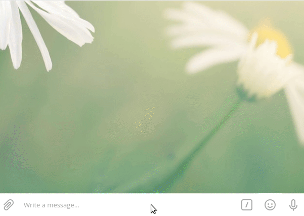

## Description

This is quiz for telegram and vk.

Example work telegram:




Example work VK:


## Project setup

It is necessary to register ENVIRONMENT variables.
The variable template and their description are in the file

## Installation

Install libraries ```pip install -r requirements.txt```

This command will immediately install:
1. python-dotenv 
2. python-telegram-bot = 11.1.0
3. vk_api
4. redis

Create project in [Redis](https://redis.com/)

#### ENVIRONMENT variables used in the project:
1. VK_TOKEN - token vk group [Create Group or Manage](https://vk.com/groups?tab=admin)
2. TELEGRAM_TOKEN - token for use telegram [@BotFather](https://t.me/BotFather)
3. TOKEN_TELEGRAM_LOGGER - token for send log in telegram [@BotFather](https://t.me/BotFather)
4. CHAT_ID - your chat id in telegram where you will be get log message. [Get Chat ID](https://t.me/userinfobot)
5. REDIS_HOST - redis db host
6. REDIS_PORT - redis db port 
7. REDIS_PASSWORD - redis password

## Start Bot

First time you need to add questions in folder questions. Question File Structure
you can see in the next section

If you want to update db with questions ```python create_question_answer```

if you want to run quiz in telegram ```python telegram_bot.py```

if you want to run quiz in vk bot ```python vk_bot.py```

## Question for quiz
Questions are stored in a folder questions in txt files. 
Question file structure.
```
Краткое описание файла с вопросами

Вопрос 1:
Текст вопроса

Ответ:
Текст ответа

Вопрос 2:
Текст вопроса

Ответ:
Текст ответа

...

Вопрос N:
Текст вопроса

Ответ:
Текст ответа
```
